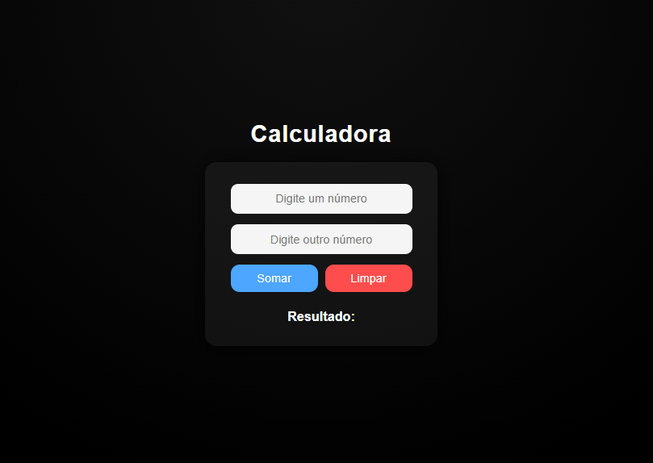

# Calculadora Js

Calculadora simples criada para treinar lógica em **JavaScript** e manipulação do **DOM**.

Acesse o projeto:  
[Calculadora Js](https://lucas-figueiredo01.github.io/Calculadora-js/)

## Prévia

## Tecnologias

- HTML
- CSS
- JavaScript

## Sobre

Projeto simples para estudo e prática de lógica e interatividade com DOM.

## Autor

Desenvolvido por Lucas Figueiredo  
GitHub:(https://github.com/lucas-figueiredo01)
